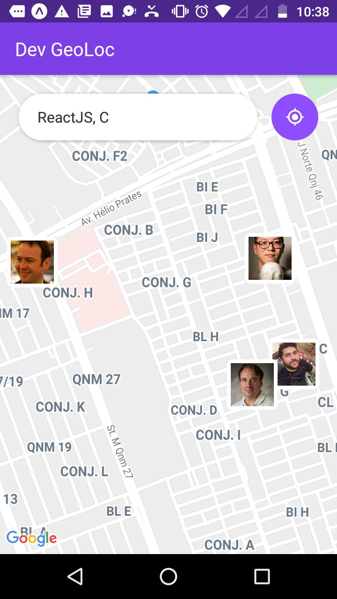
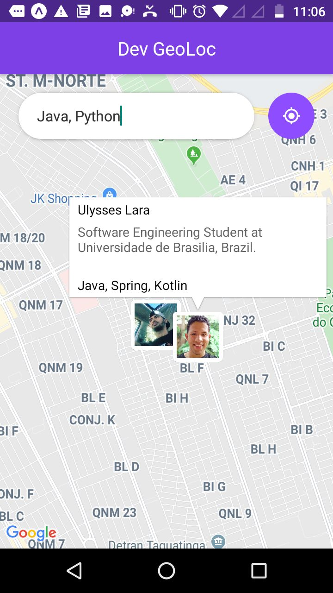
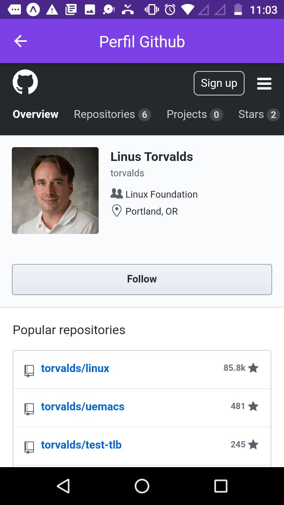

<h1 align="center">
     
</h1>

<h4 align="center">
  Find developers close to you that use the same technologies.
</h4>

## Web
<div align="center"></div>

## Mobile
<p float="left" align="middle">
  
  
  
</p>


## :rocket: Technologies

- [Node.js](https://nodejs.org/en/)
- [React](https://reactjs.org)
- [React Native](https://facebook.github.io/react-native/)
- [MongoDB](https://mongodb.com)
- [Expo](https://expo.io/)
- [Socket.io](https://socket.io/)
- [Axios](https://github.com/axios/axios)

## :warning: Prerequisites

In order to use and test the mobile app on a simulator or on your smartphone, you should've already setup the development environment for React Native applications. You can follow the following article (PT-BR) to setup your environment:

[React Native Environment (Android/iOS)](https://docs.rocketseat.dev/ambiente-react-native/introducao)

## :information_source: How To Use

To clone and run this application, you'll need [Git](https://git-scm.com), [Node.js v10.16][nodejs] or higher + [Yarn v1.13][yarn] or higher installed on your computer. From your command line:

```bash
# Clone this repository
$ git clone https://github.com/thiagorpereira/dev-geoloc

# Go into the repository
$ cd dev-geoloc

# Go into backend
$ cd backend

# Install dependencies
$ yarn install

# Start the backend server
$ yarn dev

# On another terminal, go to the frontend folder
$ cd ../frontend

# Install dependencies
$ yarn install

# Start the web server
$ yarn start

# On another terminal, go to the mobile folder
$ cd ../mobile

# Install dependencies
$ yarn install

# If you want to run the project on a simulador, start the react-native server as it is
$ react-native start

# On another terminal, install the app on your simulator
# Use the command below for iOS devices
$ react-native run-ios --simulator="iPhone XS Max"

# Use the command below for Android devices
$ react-native run-android

# If you want to run the project on your smartphone, change the baseURL on src/services/api.js to your machine's ethernet adapter IP. Use the ethernet adapter IP if you're on a cable connection or the WiFi adapter IP if you're on a wireless conecction.
# After changing the baseURL, start the react-native server
$ react-native start

# On another terminal, install the app on your smartphone
# Use the command below for iOS devices
$ react-native run-ios

# Use the command below for Android devices
$ react-native run-android
```

## :memo: License
This project is under the MIT license. See the [LICENSE](https://github.com/thiagorpereira/dev-geoloc/blob/master/LICENSE) for more information.


[nodejs]: https://nodejs.org/
[yarn]: https://yarnpkg.com/
[vc]: https://code.visualstudio.com/
[vceditconfig]: https://marketplace.visualstudio.com/items?itemName=EditorConfig.EditorConfig
[vceslint]: https://marketplace.visualstudio.com/items?itemName=dbaeumer.vscode-eslint
